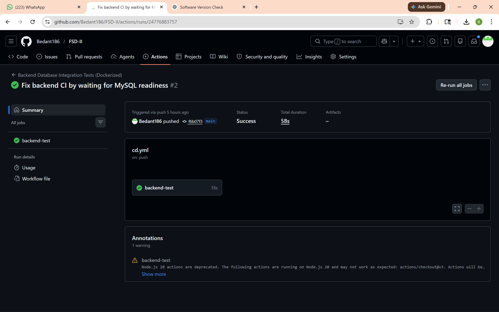
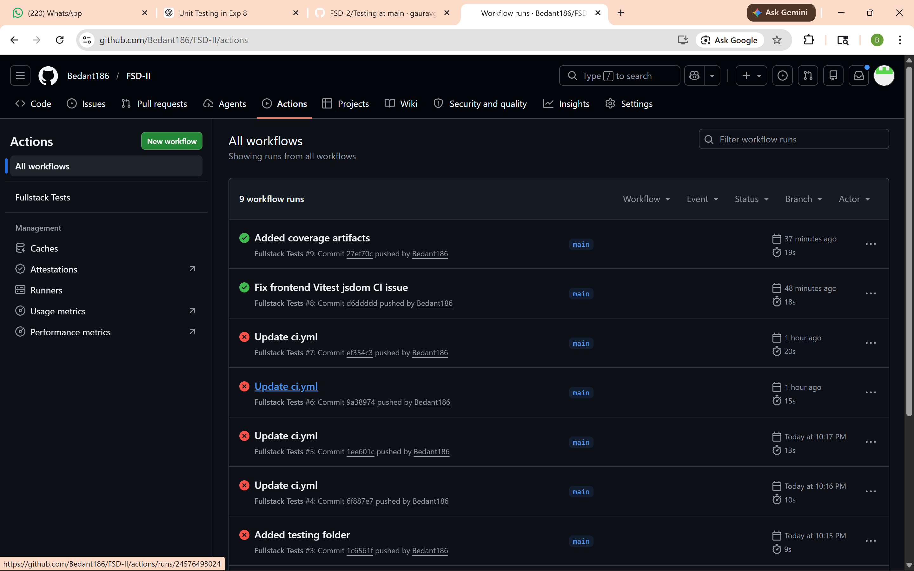
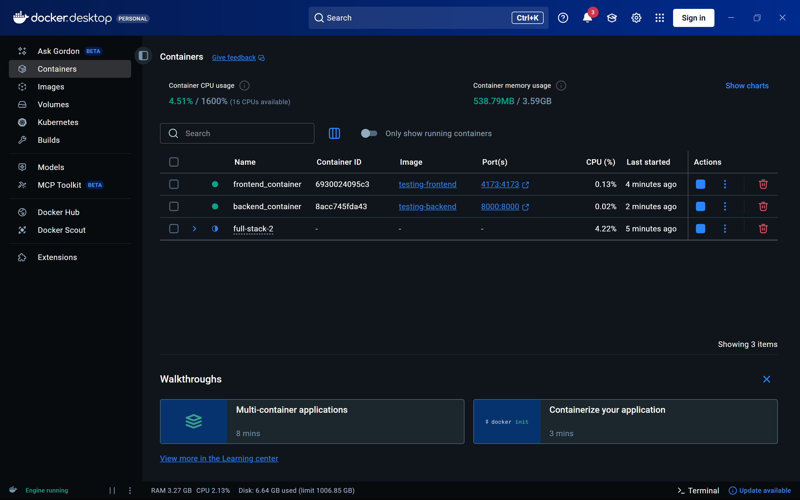
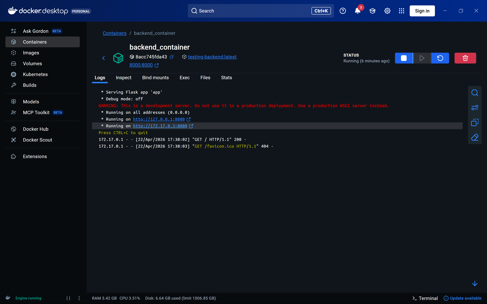
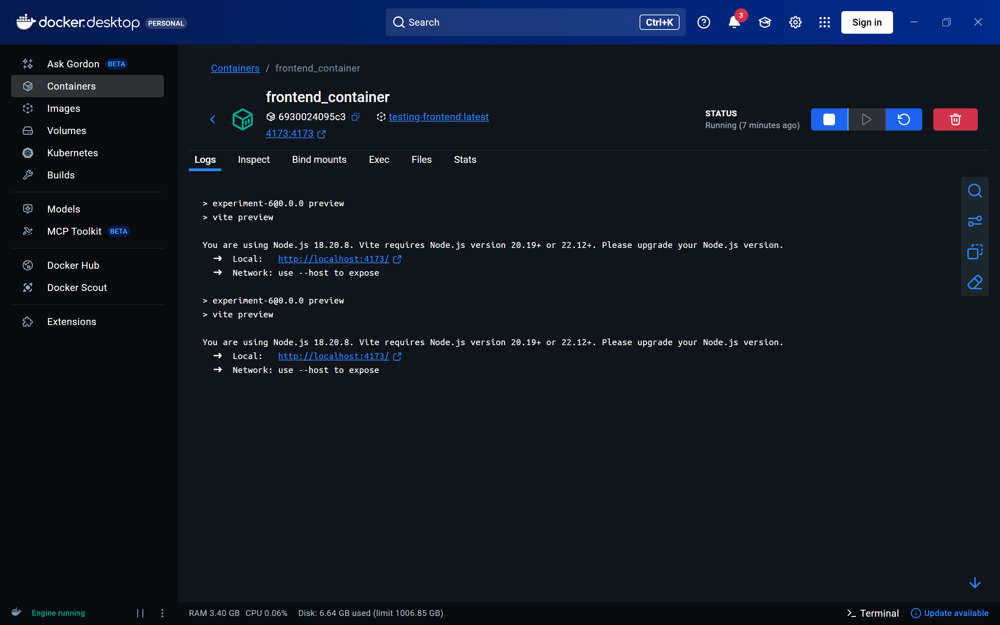
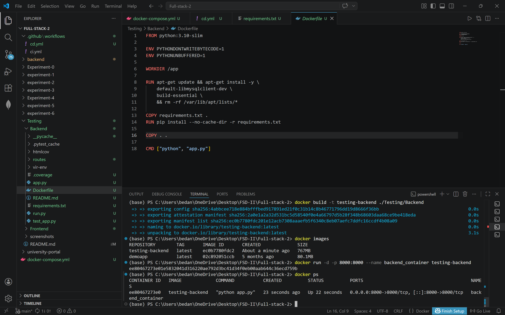
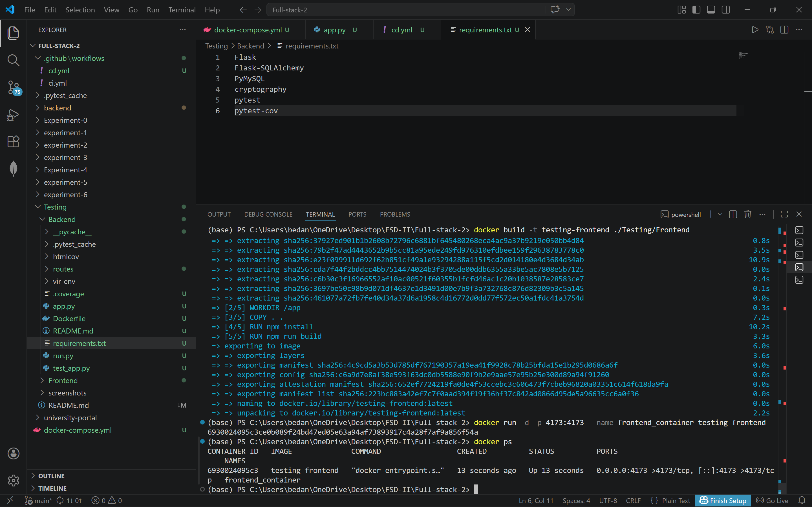
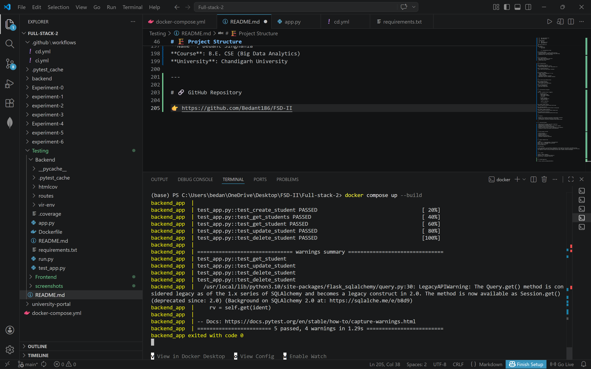

# 🚀 Experiment-20: Implement CI/CD Pipeline for Application Deployment

## 📌 Experiment Details
- **Experiment No.**: 20  
- **Title**: Implement CI/CD pipeline for application deployment  
- **Course**: Full Stack Development  
- **Objective**: Integrate Continuous Integration and Continuous Deployment (CI/CD) using Docker, Docker Compose, and GitHub Actions  

---

# 🎯 Aim
To design and implement a CI/CD pipeline that automates testing and deployment of a full-stack application using Docker containers and GitHub Actions.

---

# 🧠 Theory

CI/CD stands for **Continuous Integration and Continuous Deployment**.  
It is a DevOps practice that automates the process of building, testing, and deploying applications.

- **CI (Continuous Integration)**: Automatically tests code whenever changes are pushed.
- **CD (Continuous Deployment)**: Automatically prepares the application for deployment.

In this experiment:
- Backend is containerized using Docker.
- MySQL database is integrated using Docker Compose.
- Frontend and backend tests are automated using GitHub Actions.

---

# 🛠️ Technologies Used

- **Frontend**: React (Vite)
- **Backend**: Flask (Python)
- **Database**: MySQL
- **Testing**:
  - Backend: Pytest
  - Frontend: Vitest
- **DevOps Tools**:
  - Docker
  - Docker Compose
  - GitHub Actions

---

# 🏗️ Project Structure

```text
FSD-II/
│
├── Testing/
│   ├── Backend/
│   │   ├── app.py
│   │   ├── test_app.py
│   │   ├── requirements.txt
│   │   ├── Dockerfile
│   │
│   ├── Frontend/
│   │   ├── src/
│   │   ├── package.json
│   │   ├── Dockerfile
│
├── docker-compose.yml
│
└── .github/
    └── workflows/
        ├── cd.yml
```

        # ⚙️ Implementation Steps

## 1️⃣ Backend Setup
- Created Flask APIs for student CRUD operations  
- Connected backend to MySQL database using SQLAlchemy  
- Implemented test cases using Pytest  

---

## 2️⃣ Frontend Setup
- Built React application using Vite  
- Implemented form validation  
- Tested using Vitest  

---

## 3️⃣ Dockerization

### 🔹 Backend Dockerfile
- Created Docker image for backend  
- Installed dependencies using `requirements.txt`  

### 🔹 Frontend Dockerfile
- Built React app inside Docker container  

---

## 4️⃣ Docker Compose
- Created `docker-compose.yml` to run:
  - MySQL container  
  - Backend container  
- Configured environment variables  
- Added health check for database readiness  

---

## 5️⃣ CI/CD using GitHub Actions

### 🔹 Backend Workflow
- Builds Docker containers  
- Runs backend tests using Pytest  

### 🔹 Frontend Workflow
- Installs dependencies  
- Runs tests using Vitest  

---

# 🔁 CI/CD Workflow Flowchart

```text
Code Push → GitHub Actions Triggered
            ↓
      Backend Pipeline
      - Build Docker Image
      - Start MySQL Container
      - Run Pytest
            ↓
      Frontend Pipeline
      - Install Dependencies
      - Run Vitest Tests
            ↓
        Results (PASS/FAIL)

        # 📸 Screenshots


## 🔄 GitHub Actions


## 🔄 GitHub Actions Workflow


## 🐳 Container


## 🐳 Container backend


## 🐳 Container frontend


## 🐳 Docker Image Creation


## 🐳 Running Container


## ⚙️ Docker Compose Execution



---

# 📊 Results

- Backend tests executed successfully inside Docker container  
- Frontend tests executed successfully using Vitest  
- CI/CD pipeline successfully automated using GitHub Actions  

---

# 🎯 Learning Outcomes

- Understood CI/CD concepts and their importance  
- Learned Docker containerization  
- Implemented multi-container setup using Docker Compose  
- Automated testing using GitHub Actions  
- Solved real-world issue of service dependency (DB readiness)  
- Integrated frontend and backend testing pipelines  

---

# 🧠 Key Concepts Learned

- Containerization  
- Service orchestration  
- Automated testing  
- DevOps workflow automation  
- Continuous Integration pipelines  

---

# 🧪 Sample Commands Used

```bash
docker build -t testing-backend ./Testing/Backend
docker run -d -p 8000:8000 testing-backend
docker compose up --build
git push origin main

# 🏁 Conclusion

In this experiment, we successfully implemented a CI/CD pipeline using Docker and GitHub Actions.  
The backend and frontend were tested automatically upon code push, ensuring reliability and efficiency.  
This approach reflects real-world DevOps practices used in modern software development.

---

# 👨‍💻 Author

**Name**: Bedant Singhania  
**Course**: B.E. CSE (Big Data Analytics)  
**University**: Chandigarh University  

---

# 🔗 GitHub Repository

👉 https://github.com/Bedant186/FSD-II/tree/main/Testing
